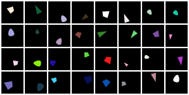
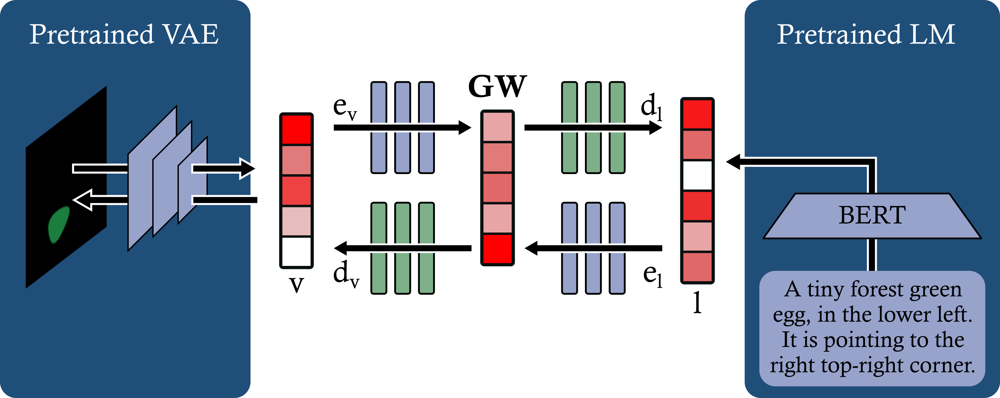

<div align="center">
    <h1>Bim GW<br><small>Bimodal Global Workspace</small></h1>
</div>

# Setup
## For development
```
git clone git@github.com:bdvllrs/bimGW.git & cd bimGW
pip install -e .
```

## Quick install
```
pip install git+https://github.com/bdvllrs/bimGW.git
```

## Configurations
They can be found in `config/`.

It contains `config/main.yaml` which is the source configuration file. To use different values, 
create a new `config/local.yaml` with updated values.

You can also create a `config/debug.yaml` which will only be loaded if the `DEBUG` environment
variable is set to `1`.

## Structure
This repo contains the library containing the modules, dataset and dataloader, and the scripts used to train,
evaluate and use the model.

The scripts are in the `scripts` folder.
The scripts use the configuration files, but they can be overridden using CLI args:
```
python train.py "max_epochs=2" "global_workspace.use_pre_saved=true"
```

# Dataset
The main dataset of the project is the custom "shapes" dataset. One can be generated using the `toy_dataset.py` script.



The dataset comprises 32x32 images. The images contain one shape (among a triangle, an "egg", and a "diamond") possessing different attributes:
- a size
- a location (x, y)
- a rotation
- a color

# The model
The model contains uni-modal modules which are pretrained:
- A VAE for the visual domain,
- a BERT and projection for the language model.



To pretrain each modality, use the corresponding training script:
- `train_vae.py` for the VAE,
- `train_lm.py` for the language model.

Once the uni-modal modules have been train, one can save the latent vectors for the dataset to speed up the training
of the full model using `save_unimodal_latents.py` script.

To train the global workspace, use the `train.py` script.
